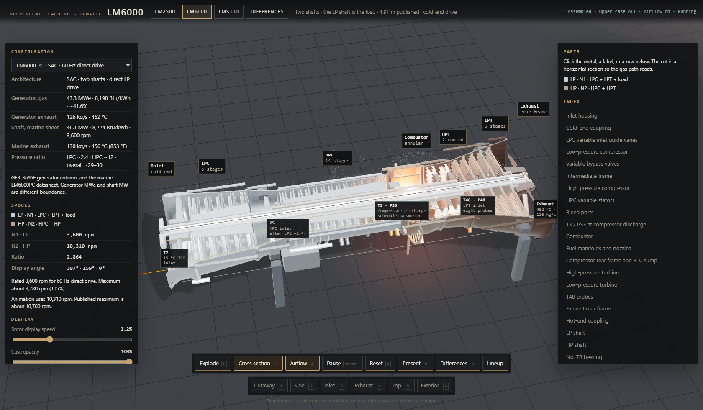
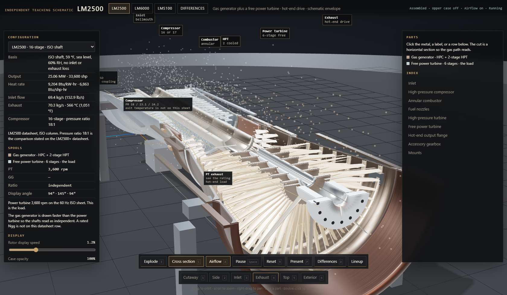
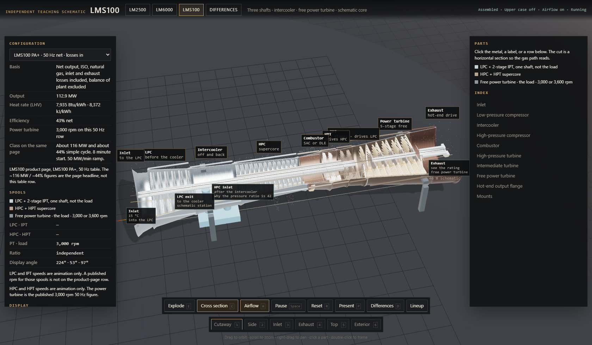
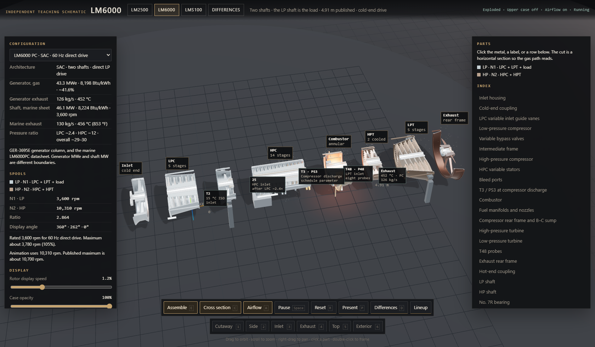
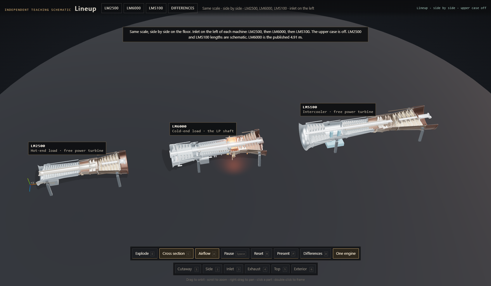
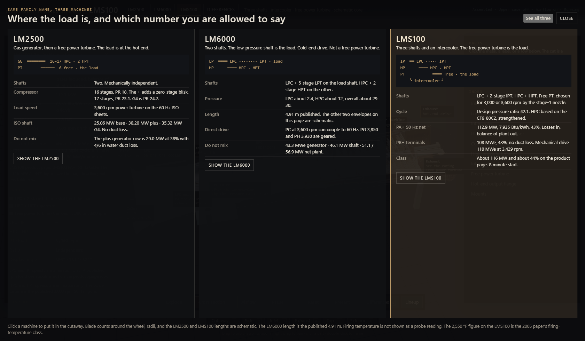

# Aeroderivative teaching schematic

Independent teaching schematic of the LM2500, LM6000, and LMS100 arrangements: cutaway, explode, airflow, and the published ratings kept on the boundary they were published with.

**[Open the page](https://2111gt.github.io/aeroderivative-schematic/)** · **[Open the model](https://2111gt.github.io/aeroderivative-schematic/viewer.html)**

The model is `viewer.html`. It is one file. Double-click it, or open the link above. It does not need a server or an internet connection. Annulus sizes and blade counts are enlarged so the gas path can be read. The LM6000 length on screen is the published 4.91 m. The other two lengths are schematic.

## LM6000

LM6000 PC, horizontal cutaway. Cold end on the left. The low-pressure shaft is the load. This row is 43.3 MWe.

## LM2500 and LMS100

LM2500, exhaust view. Six-stage free power turbine, hot-end drive. This row is 25.06 MW ISO shaft.

LMS100, cutaway. Intercooler under the shaft, free power turbine at the hot end. This row is 112.9 MW net, PA+ 50 Hz, losses in.

## Pulled apart

Same LM6000, modules separated along the shaft. Inlet on the left, exhaust frame on the right.

## Same scale

Inlets to the left: LM2500, LM6000, LMS100. Hot-end load, cold-end load, then the intercooler and free power turbine.

## Which number you are allowed to say

The comparison board. Shafts, where the load is, and the published rows that have to stay apart.

## Changing the words

Open `viewer.html` in a text editor and search for `START OF TURBINE INFORMATION`. Change the words under a line that starts with `##`. Leave the `##` line. Lines that start with a single `#` are notes. Stop at `END OF TURBINE INFORMATION`.

## License

LM2500, LM6000, LMS100, and SPRINT are trademarks of their owners. This page is not an OEM drawing, an inspection limit, or a heat balance.

The 3D view uses [Three.js](https://github.com/mrdoob/three.js) r170, included in the file under the MIT license. The license text is at the bottom of `viewer.html`.
